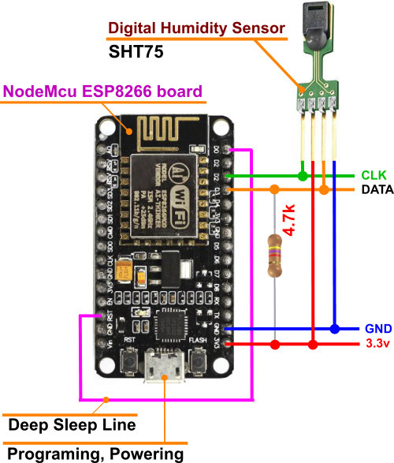

SHT75 (ტემპერატურა, ტენიანობა)
---------------------

მოცემული სენსორის საშუალებით შესაძლებელია ტემპერატურის და ტენიანობი გაზომვა.

**სენსორის ვებ გვერდი :** 
`www.sensirion.com/... 
<https://www.sensirion.com/en/environmental-sensors/humidity-sensors/pintype-digital-humidity-sensors/>`__ 

ESP8266 მოდულში ასატვირთი ბინარული ფაილი :download:`SEN_SHT75.bin <BIN/SEN_SHT75.bin>`

