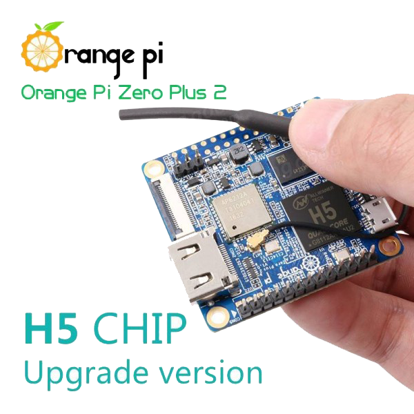

=======================
MAXIOT სისტემის პლატფორმა
=======================
დოკუმეტაციის ამ სექციაში განიხილება, MAXIOT სისტემისთვის საჭირო "ჰარდის" პარამეტერები და რესურსები 

MAXIOT სისტემის მიკროკომპიუტერი
---------------------------
MAXIOT სისტემის ყველა ძირითადი პროგრამული მოდულები დაწერილია ისე, რომ 
სრულფასოვნად გაეშვას ისეთი მიკროკომპიუტერებზე, როგორც არის `Raspberry pi <https://www.raspberrypi.org/>`__
, `Orange pi <http://www.orangepi.org/>`__ და სხვა. მცირე ზომის ერთდაფიანი მიკროკომპიუტერები მრავლად არის
წარმოდგენილი თანამედროვე ბაზარზე. მიკროკომპიუტერები ერთმანეთისგან განსხვავდება 
სხვადასხვა პერიფერიული მოწყობილობათა კომლექტაციით, პროცესორის წაროებლით, 
ოპერატიული მეხსირების რაოდენობით და სხვა. ყელა მიკროკომპიუტერის პროცესორის
არქიტეკტურა 32 და 64 ბიტიანი ARM Cortex. MAXIOT სისტემის შექმნილია ისე რომ
ის ეშვებოდეს ისეთი მცირე ზომის მიკროკომპიუტერებზე როგორიც არის Raspberry pi zero და 
Orange pi zero. 

   
სუსტი მიკროკომპიუტერის არჩევის შემთხვევაში, ჩვენ უნდა გავითვალისწინოთ
ის ფატორი რომ, ჩვენ ვიქნებით შეზღუდული კომპიუტერული რესურსებში, რაც უცილებლად არის 
გასათვალისწინებელი რადგან გარდა MAXIOT სისტემის მოდულებისა, ამავე მიკროკოპიუტერებზე
ხდება სხვადასხვა დამაებითი პროგრამების გაშვება, რომლებიც ამდიდრებენ MAXIOT სისტემის
დამატებითი შესაძლებლობებით. მაგალითად მონაცემთა ბაზები, რომლებიც უზრუნველყოფენ მინაცემების
დაგროვებას ანდა მინაცემთა ასახვის პლიკაციები, რომლებიც უზრუნველყოფენ მონაცემების ასახვას
სხვადასხვა სტილის გრაფიკების და ჩართების საშულაებით. 

ოპერატიული მეხსიერება
------------------
ოპერატიული მეხსიერება მიკროკომპიუტერის სისტემაში შემავალი ერთერთი ძალიან მნიშვნელოვანი ნაწილიs წარმოადგენს.
პრაქტიკულად ყველა აპლიკაცია რომელიც გაშვებულია მიკროკომპიუტერში, ოპერაციულ სისტემის ჩათვლით 
იყენებს სხვადასხვა რაოდენობის ოპერატიულ მეხიერებას. ზოგიერთ შემტხვევაში აპლიკაციის მიერ გამყენებული 
ოპერატიული მეხსიერების რაოდენობა დინამიურად იცვლება. გამოყენებული მეხიერების ზრდა ხდება, აპლიკაციაზე
დატვრთვის ზრდასთან ერთად. MAXIOT სისტემაში შემავალი ზოგიერთი პროგრამული მოდული ასევე განიცდის 
ოპერატიული მეხსიერების გამოყენების ზრდას - რაც უფრო მეტ ობიექტს ამუშავებს სისტემა, მით მეტი ოპერარტიულ
მეხსიერებაა საჭირო. ამიტომ ეს ფაქტორი აუცილებლად უნდა გავითვალისწინოთ ჩვენი სისტემისთვის მიკროკომპიუტერის
შერჩევის დროს. მაგალითად Raspberry pi zero-ს სულ 512 მეგაბაიტი ოპერატიული მეხსიერება გააჩნია, რაც 
საკმაოდ პატარა, თუმცა საკმარისი მცირე ამოცნაბის შესასრულებლად.

დამატებითი პერიფერიული მოწყობილობა
------------------------------

