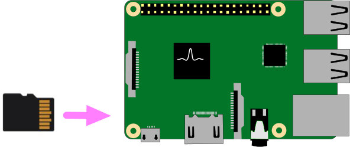
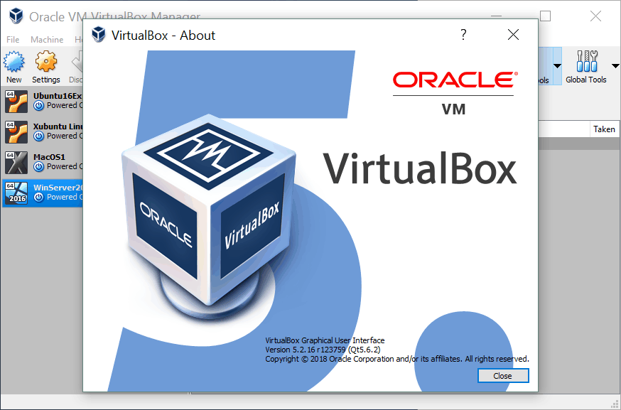
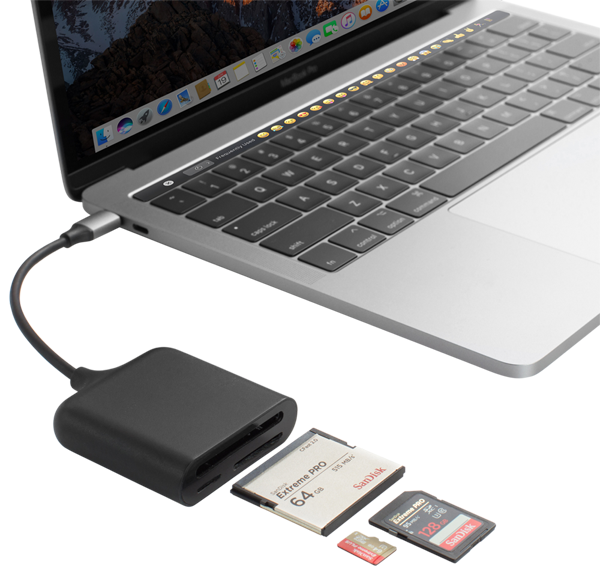

*******************
MAXIOT სისტემის მომზადება
*******************
MAXIOT სისტემია შედგება ძირითადი და ბევრი სხვადასხვა დამხმარე პროგრამებბისგან.
იმის და მიხედვით თუ რა ამოცანა აქვს შესასრულებელი სისტემას, ძირითად პროგრამებთან 
ერთად სისემის მუშაობის პროცეში ერთვება ბევრი სხვადასხვა დამხმარე პროგრამა. 
თუმცა შესასრულებელი ამოცანები 
იმდენად მრავალფეროვანი შეიძლება იყოს, რომ უბრალოდ შეუძლებელია წინასწარ განისაზღვროს
ყველა დამხმარე პროგრამების ვინაობა.

იმისთვის რომ მომხმარებელს გავუმარტივოთ MAXIOT სისტემის გამართვა, ჩვენ წინასწარ შევქმენით
SD ბარათის გამოსახულება. ამ გამოსახულების გადატანით SD ბარათში, ჩვენ მივიღებთ ბარათს
მასზე განთავსებული ოპერაციული სისტემით, დაკომფიგურირებული MAXIOT სისტემით და
დამაებითი დამხმარე პროგრამებით(დამხმარე პროგრამების სია ცალკე იქნება მოცემული). ბარათის 
დამაზადების შემდეგ ჩვენ შეგვილია ის განვათავსოთ იმ მიკროკომპიუტერზე, რომლისთვისაც იყო შექმნილი
SD ბარათის გამოსახულება, იქნწბა ეს `Raspberry pi <https://www.raspberrypi.org/>`__
, `Orange pi <http://www.orangepi.org/>`__ და თუ სხვა. 

   
ასევე მომხმარებლისთვის წინასწარ არის შექმნილი `VirtualBox <https://www.virtualbox.org/>`__
ვირტუალური კომპიუტერების პლატფორმისთვის შექმნილი MAXIOT სისტემის გამოსახულება.

სისტემური დისკის ფაილი
=================
ინფორმაცია მალე დაემატება

SD ბარათის მომზადებაა
=================
იმიათვის რომ SD ბარათის გამოსახულება გადავიტანოთ უშუალოდ SD ბარათზე, ჩვენ დაგვჭირდება
SD ბარათების წამკითხველი მოწყობილობა ( `Memory card reader <https://en.wikipedia.org/wiki/Memory_card_reader>`__ ) : 

   
ასეთი წამკითხველები მრავლად არის წარმოდგენილი კომპიუტერული ტექნიკის ბაარზე. ასევე ზოგიერთ ლეპტოპს მოყვება 
ჩამონტაჯებული დისკების წამკითხველი.

MAXIOT სისტემის კომპიუტერულ ქსელსი ჩართვა
=================
ინფორმაცია მალე დაემატება

