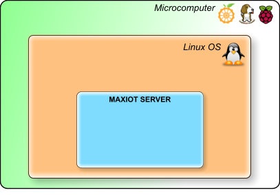
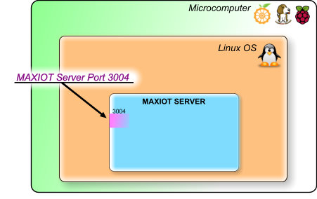

==============
MAXIOT SERVER
==============

MAXIOT SERVER-რი ეს არის MAXIOT სისტემის მთავარი ნაწილი, რომელიც უზრუნველყოფს
საგნების ინტერნეტისთვის (`IOT <https://en.wikipedia.org/wiki/Internet_of_things>`__) 
საჭირო ყველა ძირითად ფუნქციებს. 

MAXIOT SERVER-რი უზრუნველყოფს იმ ვირტუალურ სამყაროს არსებობას, რიმელშიც იმყოფება 
ფიზიკური სამყაროდან შემოყვანილი და ასევე ვირტუალური სამყაროში შექმნილი მოწყობილობები.
ასეთ მოსყობილობებს სისტემაში, MAXIOT კომპონენტები ეწოდება. MAXIOT SERVER-რი ასევე
უზრუნველყოფს კომპონენტების შორის შექმნილი კავშირების არსებობას. 
MAXIOT SERVER-რიში ფიზიკური მოსწყობიობების შემოყვანას, ვირტუალური მოწყობილობის
შექმნას და მათ შორის კავშირების დადგენა ხდება MAXIOT STUDIO - ვებ აპლიკაციის საშუალებით.
MAXIOT STUDIO-სთან დაკავშირებული საკითხები განიხილულია ამ დოკუმენტაციის შესაბამის სექციაში.

MAXIOT SERVER-რის აპლიკაცია
დაწერილია `C <https://en.wikipedia.org/wiki/C_(programming_language)>`__ ენის გამოყენებით 
და მის სამუშაო გარემოს წარმოადგენს `ლინუქსის <https://en.wikipedia.org/wiki/Linux>`__ ოპერაციული 
სისტემა. სერვერის შეიძლება დაკომპილირდეს როგორც `ARM <https://en.wikipedia.org/wiki/ARM_architecture>`__ ასევე 
`x86 <https://en.wikipedia.org/wiki/X86>`__ არქიტეკტურის კომპიუტერებზე, 
შესაბამისად სერვერის დაინსტალირება შესაძლებელია პრაქტიკულად ნებიმიერი მიკროკომპიუტერის
ან ვირტუალური კომპიუტერის პლათფორმაზე. MAXIOT SERVER-რის პროგრამული კოდი დაწერილია ისე
, რომ რაც შეიძლება ოპტიმიალურად იყოს გამოიყენებული კომპიუტერის პროცესორის და ოპერატიული 
მეხსიერების რესურსები.

როგორც მრავალი სხვა სერვერი MAXIOT SERVER-იც ჩართულია კომპიუტერულ ქსელში და მასთან 
დაკავშირება ხდება ინტერნეტ TCP/IP ქსელური პროტოკოლის საშუალებით. სხვადასხვა გარე მოწყობილობები 
შემოდიან MAXIOT SERVER-ში სპეციალურად მათთვის შექმნილი 3004 პორტის გავლით. **(რა არის პორტი)** 
თუ სერვერს წამოვიდგენთ როგორც რამე დაწესებულებას, მაშინ პორტი ეს არის რომელიმე ოთახის კარები. 
დაწესებულებაში არსებულ ყველა ოთახს გააჩნია კარებეი თავისი უნიკალური ნომრით, შესაბამისად 
დაწესებულებაში შემოსულმა კლიენტმა იცის რა მისთვის საჭირო ოთახის ნომერი, პირდაპირ მიემართება
შესაბამის ოთახისკენ.

   
MAXIOT SERVER-ის ლოკალური მოწყობილობა არ იყენებს 3004 პორტს, რადგან ის ისედაც იმყოფება 
სერვერის შიდა სივრცეში. ამ მოწყობილობას ქვია მედიატორი (Mediator)(Me) - რადგან ხშირად ის 
გამოიყენება სხვა მოწყობილობებიდან წარმოქმნილი მონაცემების დამუშავებისთვის. **მაგალითად:**
მედიატორს(me) შეუძლია გარე ტემპერატურის საზომი მოწყობილობიდან ფარენგეიტებში მიღებული ტემპერატურა   
გარდაქმნას ცელსიუსში და გადაუგზავნოს მოწყობილობას, რომელიც ასახავს ტემპერატურას რაიმე დისპლაიზე.

**მაგალითად:** დამუშავებული მონაცემების გადაეცემეა სხვა გარე 
მოწყობილობას ან  მონაცემების შენახვა რომე მონაცემთა ბაზებში და სხვა.... ასეთი სცენარი შეიძლება
იყოს უსასრულოდ ბევრი, რადგან უშუალოდ სისტემის მენეჯრი ქმნის მოქმედებეის სცენარის სკრიპტს.
კომპონენტი მედიატორი გამოსახუია ნახატში როგორც ნარინჯისფერი წრე შიგნით განტავსებული Me
სიმბოლოებით.

.. image:: ../images/2_03.jpg
   :width: 400
   :align: center

რა არის კლიენტი
-----------------------------

