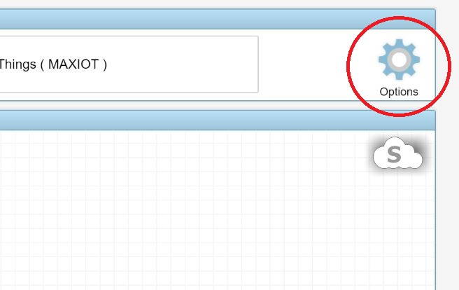
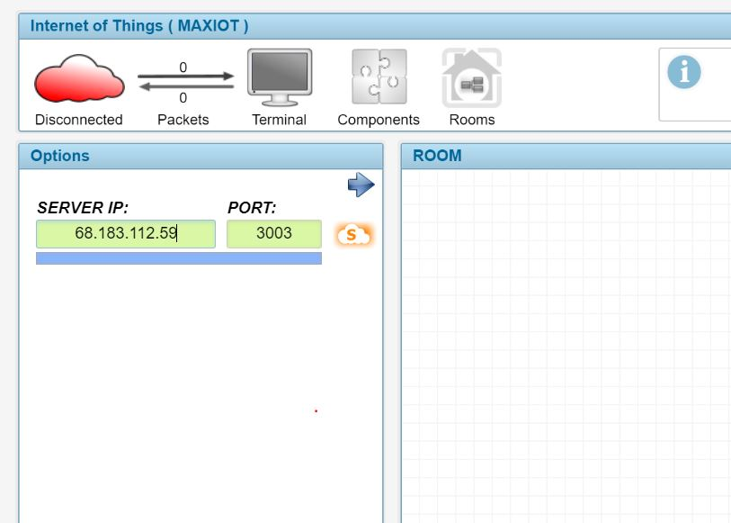

*******************
MAXIOT STUDIO
*******************
MAXIOT STUDIO ეს არის ინსტრუმენტი, რომლის საშუალებით ჩვენ შეგვიძლია ვიმუშაოთ
MAXIOT SERVER-რში რეალიზებულ ვირტუალურ სივრცესთან და სივრცეში განთავსებულ კომპონენტებთან.

ზოგადი აღწერა
=================
**MAXIOT STUDIO** წარმადგენს ვებ აპლიკაციას, რომლის ძირითადი ნაწილი დაწერილია პროგრამული ენის - ჯავა სკრიპტის
გამოყენებით. რადგან **MAXIOT STUDIO** წარმადგენს ვებ აპლიკაციას, მას არ ჭირდება დაინსტალირება -
მისი გაშვება შეიძლება, როგორც რომელიმე ვებ საიტიდან, სადაც ის განთავსებულია, ასევე გადმოწერის 
შემთხვევაში უშუალოდ პერსონალური კომპიუტერის ლოკალური დისკიდან, ორივე შემთხვევაში 
**MAXIOT STUDIO**-ს მუშაობას უზრუნველყოფს ვებ ბროუზერი. 

.. image:: ../images/3_01.jpg
   :width: 500
   :align: center

**MAXIOT STUDIO** საკმაოდ დიდი აპლიკაციაა, რომელშიც გამოყენებულია ბევრი სხვადასხვა ჯავა ბიბლიოთეკა.
არსებობს განსხვავება სხვადასხვა ვებ ბროსზერებს შორის - **MAXIOT STUDIO**
გამართულად მუშაობს `Goolge Chrome <https://www.google.com/chrome/>`__ ვებ ბროუზერში.
მიუხედავათ იმისა, რომ Goolge Chrome ეშვება მრავალ სხვადასხვა მოწყობილობაზე,
ამ ეტაპზე **MAXIOT STUDIO** მიერ მოთხოვნილი რესურსები, უფრო კარგად მიესადაგება პერსონალურ
კომპიუტერის რესურსებს.

STUDIO-ს გაშვება
===============
**STUDIO-ს ვებ აპლიკაციის გაშვება, შეგვიძლია სხვადასხა ხერხით:**

 * www.max-iot.com ვებ საიტზე იპოვეთ და დააჭირთ**MAXIOT STUDIO APP** - წარწერას. 
   ეს მეთოდი იტხოვს ინტერნეტის არსებობას და კარგია იმით რომ თქვენს მიერ გახსნილი 
   **MAXIOT STUDIO** აპლიკაცია იქნება ყოველთვის ბოლო ვერსიის.
 * თუ თქვენ კომპიუტერი იმყოფებით იმავე ლოკალურ ქსელში, რომელშიც იმყოფება MAXIOT სისტემის პლატფორმა
   (მიკროკომპიუტერი რომელშიც გაშვებულია MAXIOT სერვერი) მაშინ შეგიძლიათ `Goolge Chrome <https://www.google.com/chrome/>`__ 
   მისამართის ველში ჩაწეროთ პლატფორმის სახელი, რის შედეგად გაიხსენბა ვებ გვერდი სადაც 
   უნდა იპოვოთ და დააჭიროთ **MAXIOT STUDIO APP** - წარწერას. გახსოვდათ, რომ 
   ამ მეთოდით გახსნილი **MAXIOT STUDIO** აპლიკაცია არ იქნება ბოლო ვერსიის.
 * www.max-iot.com ვებ საიტიდან თქვენ შეგიძლიად გადმოწეროთ zip ფორმატით 
   დაარქივებული **MAXIOT STUDIO** აპლიკაცია. გადმოწერეთ და და განაარქივეთ თქვენთვის სასურველ
   ადგილას. აპლიკაციის გაშვების შემთხვევაში `Goolge Chrome <https://www.google.com/chrome/>`__ 
   ვებ ბროზერის მისამართების ვეში ჩაწერეთ გა განარქივებული ფოლდერში მყოფი index.html -ფაილამდე.

STUDIO-ს IP მისამართი და სახელი
=============================

იმისთვის რომ **MAXIOT STUDIO** დავაკავშიროთ **MAXIOT SERVER**-თან, ამისთვის უნდა ვიცოდეთ
იმ ფიზიკური ან ვირტუალური კომპიუტერის სახელი ან `IP <https://en.wikipedia.org/wiki/IP_address>`__ 
მისამართი, რომელზეც გაშვებულია 
**MAXIOT SERVER**-ი. უშუალოდ კომპიუტერი შეიძლება იყოს ჩართული ლოკალურ ქსელში 
`Wi-Fi <https://en.wikipedia.org/wiki/Wi-Fi>`__  ან  
`Ethernet <https://en.wikipedia.org/wiki/Ethernet>`__ - ტის საშუალებით, როგორც
ეს აღწერილია დოკუმენტაციის (MAXIOT SERVER - გარე ქსელთან კავშირი) სექციაში.
ორივე შემთხვევაში კომპიუტერის ჩართვისას მას ენიჭება რაიმე 
`IP <https://en.wikipedia.org/wiki/IP_address>`__ მისამართი, რაც წარმოადგენს 
პრობლემას რადგან ჩვენ არ გვეცოდინება შეცვლილი `IP <https://en.wikipedia.org/wiki/IP_address>`__ 
მისამართი, ისევე როგორც არ ეცოდინება იმ სხვა მოწყობილობებს, რომლებიც უნდა დაუკავშირდნენ 
**MAXIOT SERVER**-ს. აქედან არსებობს 2 გამოსავალი:

 * MAXIOT პლატფორმის კომპიუტერი ისე უნდა დავაკონფიგურიროდ, რომ მისი ჩართვისას
   მისი `IP <https://en.wikipedia.org/wiki/IP_address>`__  მისამართი არ იცვლებოდეს, რაც მოითხოვს 
   ოპერაციული სისტემა `ლინუქსის <https://en.wikipedia.org/wiki/Linux>`__ გარკვეულ ცოდნას.
 * `IP <https://en.wikipedia.org/wiki/IP_address>`__  მისამართის მაგივრად გამოვიყენოთ
   კომპიუტერის სახელი, რომელიც ნებისმიერ შემთხვევაში უცვლელია.
   
შეგახსენებთ რომ დოკუმენტაციის ამ სექციაში განხილულია, ის შემთხვევა როდესაც **MAXIOT SERVER**
და მოწყობილობა რომელიც მას უკონექტდება იმყოფებიან ერთიდაიგივე ლოკალურ ქსელში. სულ სხვა
მოცემულობაა როცა საჭიროა, რაიმე მოწყობილობის გარე ქსელიდან დაკავშირება **MAXIOT SERVER** - თან. 
ეს ბოლო არა განიხილული ამ დოკუმენტაციაში რადგან ის 
ითხოვს `IT <https://en.wikipedia.org/wiki/Information_technology>`__ ტექნოლოგიების 
გარკვეულ ცოდნას.

STUDIO-ში სერვერის მისამართის მითითება
===========================

იმისთვის რომ **MAXIOT STUDIO** დავაკავშიროთ **MAXIOT SERVER**-თან, ამისთვის ჯერ უნდა მივუთითოთ აპლიკაციას
**MAXIOT SERVER** - ის მისამართი, ამისთვის:
 
გავხსანთ MAXIOT STUDIO აპლიკაცია  `Goolge Chrome <https://www.google.com/chrome/>`__ -ში
, დავაჭიროთ ლოგოს რომელიც იმყოფება აპლიკაციის მარჯვენა ზედა კუთხში , რომლის ქვემოთ არის წარწერა 
Options. 

აპლიკაციის მარცხენა მხარეს გაიხსნება მისამართის შესაყვანი ორი მწვანე ველი. 
სადაც პირველი ველში, რომლის თავზე არის წარწერა **SERVER IP:** უნდა ჩაიწეროს
**MAXIOT SERVER**-ს `IP <https://en.wikipedia.org/wiki/IP_address>`__  მისამართი
ან სახელი. 
   

   
მეორე ველში, რომლის თავზე არის წარწერა **PORT:** უნდა ჩაიწეროს, ის პორტის
ნომერი, რომელიც სპეციალურად არის გამოყოფილი  **MAXIOT STUDIO**-თვის. სტანდარტულად
ამ პორტის ნომერია **3003**

.. image:: ../images/3_08.jpg
   :width: 550
   :align: center 

იმისთვის, რომ დავიმახსოვროთ პარამეტრები უნდა დავაჭიროთ მწვანე ველების გვერით არსებულ ლოგოს - 
ნარინჯისპერ ღრუბლი, რომლის შიგნით არის მოთავსებუი სიმბოლო **S** - რაც ნიშნავს Save-ს დამახსოვრებას.

იმისთვის, რომ გამოვიდეთ **Options** რეჯიმიდან, დააჭირეთ აპლიკაციის მარცხენა ზედა კუთხეში არსებულ
დიდ წითელი ღრუბლის ლოგოს.

STUDIO-ს დაკონექტება ლოკალურ სერვერთან
===========================

STUDIO ტერმინალი და საინფორმაციო დაფა
=================
ინფორმაცია მალე დაემატება

STUDIO-ს  დაკავშირება MAXIOT-ის სერვერთან
=================
ინფორმაცია მალე დაემატება

STUDIO კომპონენტების ოთახები
=================
ინფორმაცია მალე დაემატება

STUDIO კომპონენტებთან მუშაობა
=================
ინფორმაცია მალე დაემატება

კომპონენტების - სისტემაში დამატება 
-------------------------
ინფორმაცია მალე დაემატება

